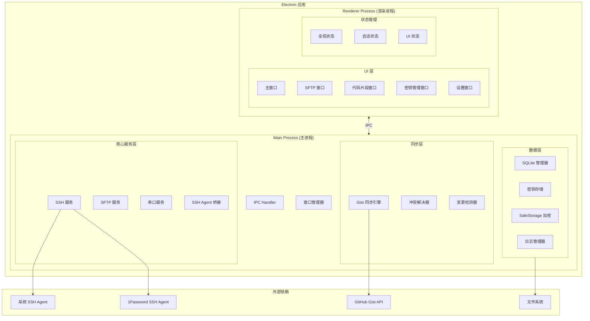
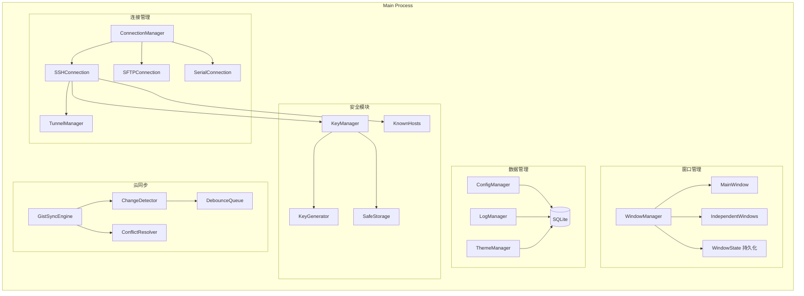
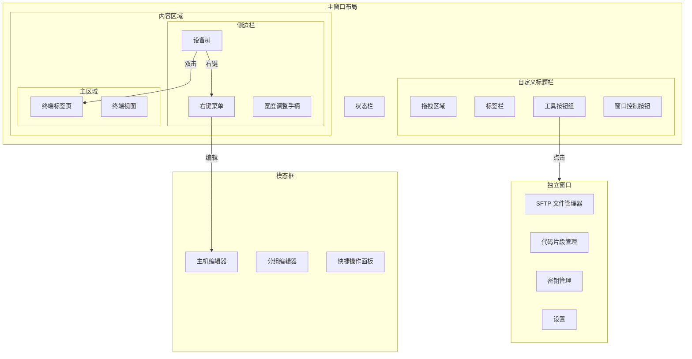
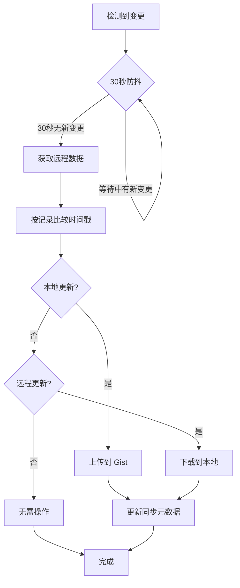

# SSH Client 架构设计文档

## 技术栈

| 层级 | 技术选型 |
|------|----------|
| 框架 | Electron |
| 前端 | React + Vite + Tailwind CSS |
| 终端 | xterm.js + xterm-addon-* |
| SSH | ssh2 |
| 串口 | serialport |
| 数据库 | SQLite (better-sqlite3) |
| 安全存储 | Electron safeStorage API |
| 云同步 | GitHub Gist API |

---

## 1. 系统整体架构



---

## 2. 主进程模块架构



---

## 3. 渲染进程 UI 架构



---

## 4. 主窗口详细布局

```
┌─────────────────────────────────────────────────────────────────────────┐
│ [拖拽区域]   │ + │Tab1 │Tab2 │(如果存在,不存在则隐藏tab) │ 📁 📝 🔑 ⚙️│ ― □ ✕ │
├─────────────┼──────────────────────────────────────────────────────────┤
│             │                                                          │
│  ▼ 生产环境  │  $ ssh user@server                                       │
│    ├ Web-01 │  Welcome to Ubuntu 22.04 LTS                             │
│    ├ Web-02 │                                                          │
│    └ DB-01  │  user@server:~$ █                                        │
│             │                                                          │
│  ▼ 测试环境  │                                                          │
│    └ Test-01│                                                          │
│             │                                                          │
│  ▼ 串口设备  │                                                          │
│    └ COM3   │                                                          │
│             │                                                          │
│ [可拖拽边缘] │                                                          │
├─────────────┴──────────────────────────────────────────────────────────┤
│ 🟢 已连接 │ 隧道: L:8080→R:80 │ 延迟: 23ms │ 192.168.1.100           │
└─────────────────────────────────────────────────────────────────────────┘

注：Windows 下工具按钮组左移，为窗口控制按钮腾出空间
    macOS 下窗口控制按钮在左侧，布局无需调整
```

### 同步策略



---

## 5. 目录结构

```
ssh-client/
├── electron/                    # Electron 主进程
│   ├── main.ts                  # 入口文件
│   ├── preload.ts               # 预加载脚本
│   │
│   ├── windows/                 # 窗口管理
│   │   ├── WindowManager.ts
│   │   ├── MainWindow.ts
│   │   └── IndependentWindow.ts
│   │
│   ├── services/                # 核心服务
│   │   ├── ssh/
│   │   │   ├── SSHService.ts
│   │   │   ├── SFTPService.ts
│   │   │   ├── TunnelManager.ts
│   │   │   └── AgentBridge.ts
│   │   ├── serial/
│   │   │   └── SerialService.ts
│   │   └── terminal/
│   │       ├── ZmodemHandler.ts
│   │       └── BroadcastManager.ts
│   │
│   ├── data/                    # 数据层
│   │   ├── Database.ts          # SQLite 管理
│   │   ├── repositories/        # 数据仓库
│   │   │   ├── HostRepository.ts
│   │   │   ├── KeyRepository.ts
│   │   │   ├── SnippetRepository.ts
│   │   │   └── ...
│   │   └── migrations/          # 数据库迁移
│   │
│   ├── security/                # 安全模块
│   │   ├── KeyManager.ts
│   │   ├── KeyGenerator.ts
│   │   ├── SafeStorageWrapper.ts
│   │   └── KnownHostsManager.ts
│   │
│   ├── sync/                    # 云同步
│   │   ├── GistSyncEngine.ts
│   │   ├── ChangeDetector.ts
│   │   ├── ConflictResolver.ts
│   │   └── SyncScheduler.ts
│   │
│   └── ipc/                     # IPC 处理
│       ├── handlers/
│       └── IPCBridge.ts
│
├── src/                         # React 渲染进程
│   ├── main.tsx                 # React 入口
│   ├── App.tsx
│   │
│   ├── components/              # UI 组件
│   │   ├── layout/
│   │   │   ├── TitleBar.tsx
│   │   │   ├── Sidebar.tsx
│   │   │   ├── StatusBar.tsx
│   │   │   └── TabBar.tsx
│   │   ├── terminal/
│   │   │   ├── TerminalView.tsx
│   │   │   ├── TerminalTabs.tsx
│   │   │   └── SearchBar.tsx
│   │   ├── device-tree/
│   │   │   ├── DeviceTree.tsx
│   │   │   ├── TreeNode.tsx
│   │   │   └── ContextMenu.tsx
│   │   ├── modals/
│   │   │   ├── HostEditor.tsx
│   │   │   ├── GroupEditor.tsx
│   │   │   └── TunnelEditor.tsx
│   │   └── common/
│   │
│   ├── windows/                 # 独立窗口页面
│   │   ├── sftp/
│   │   │   ├── SFTPWindow.tsx
│   │   │   ├── FileList.tsx
│   │   │   └── TransferQueue.tsx
│   │   ├── snippets/
│   │   │   └── SnippetManager.tsx
│   │   ├── keys/
│   │   │   ├── KeyManager.tsx
│   │   │   └── KeyGenerator.tsx
│   │   └── settings/
│   │       ├── SettingsWindow.tsx
│   │       ├── GeneralSettings.tsx
│   │       ├── TerminalSettings.tsx
│   │       ├── ThemeSettings.tsx
│   │       ├── ShortcutSettings.tsx
│   │       └── SyncSettings.tsx
│   │
│   ├── hooks/                   # React Hooks
│   │   ├── useTerminal.ts
│   │   ├── useConnection.ts
│   │   ├── useTheme.ts
│   │   └── useShortcuts.ts
│   │
│   ├── store/                   # 状态管理
│   │   ├── index.ts
│   │   ├── slices/
│   │   │   ├── sessionSlice.ts
│   │   │   ├── uiSlice.ts
│   │   │   └── settingsSlice.ts
│   │   └── selectors/
│   │
│   ├── services/                # 渲染进程服务
│   │   └── ipc.ts               # IPC 客户端
│   │
│   ├── styles/                  # 样式
│   │   ├── index.css
│   │   └── themes/
│   │
│   └── types/                   # TypeScript 类型
│       └── index.ts
│
├── assets/                      # 静态资源
│   └── fonts/
│       └── JetBrainsMono/       # 内置等宽字体
│
├── scripts/                     # 构建脚本
│
├── package.json
├── electron-builder.yml         # 打包配置
├── vite.config.ts
├── tailwind.config.js
└── tsconfig.json
```

---


## 6. 技术要点

### 7. 自定义标题栏
```
- 使用 frameless window
- CSS: -webkit-app-region: drag / no-drag
- Windows: 右侧放置窗口控制按钮
- macOS: 左侧预留系统按钮空间 (traffic lights)
```

### 7.1 xterm.js 插件
```
- @xterm/addon-fit          # 自适应尺寸
- @xterm/addon-search       # 搜索功能
- @xterm/addon-web-links    # 链接识别
- @xterm/addon-unicode11    # Unicode 支持
- @xterm/addon-webgl        # GPU 渲染 (可选)
- zmodem.js                 # Zmodem 支持
```

### 7.2 密钥文件存储
```
位置: {userData}/keys/
文件: {keyId}.pem
元数据: SQLite keys 表
加密: safeStorage 加密 passphrase
```

### 7.3 日志存储
```
位置: {userData}/logs/{hostId}/{date}.log
格式: 纯文本，带时间戳
轮转: 按日期分文件
```

---

## 7.4 安全考虑

| 数据类型 | 存储方式 | 同步方式 |
|----------|----------|----------|
| 主机密码 | safeStorage 加密后存 SQLite | 加密后同步 |
| 密钥文件 | 原文件 + safeStorage 加密 passphrase | 加密后同步 |
| GitHub Token | safeStorage 加密 | 不同步 |
| 其他配置 | SQLite 明文 | 明文同步 |
